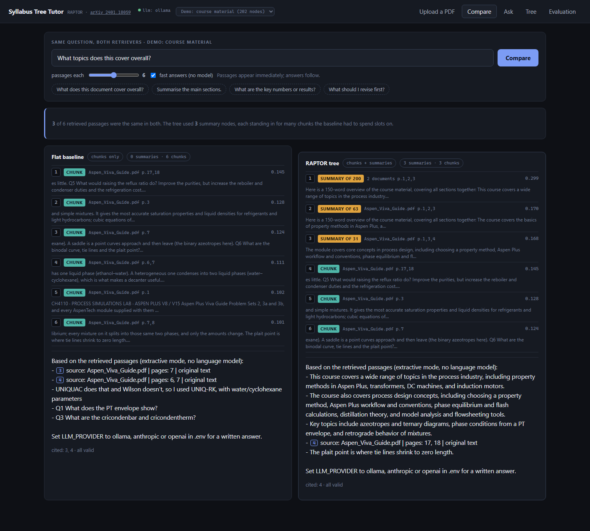
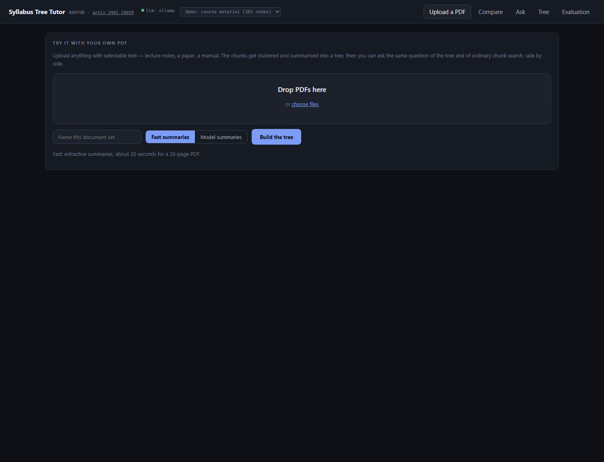

# Syllabus Tree Tutor

Question answering over your own PDFs, built on **RAPTOR: Recursive Abstractive
Processing for Tree-Organized Retrieval** ([arXiv 2401.18059](https://arxiv.org/abs/2401.18059)),
with an ordinary chunk-search baseline running beside it so you can see what the
tree actually buys.

Ordinary RAG splits documents into chunks and searches the chunks. That works for
narrow questions ("what is the full-load slip?") and badly for broad ones ("what
does this cover?"), because no single chunk contains the answer to a broad
question. RAPTOR clusters the chunks, summarises each cluster, and repeats up to
a single root — then searches every level at once, so a broad question can match
a summary that already spans a hundred chunks.



Above: one question, both retrievers, one index, answers written by
`llama3.2:3b` running locally.

The **baseline** spends all six slots on chunks, and its answer simply replays
the Q&A fragments it retrieved — it never answers "what topics does this cover".
The **tree** spends three slots on summaries covering 200, 63 and 31 chunks
(scoring 0.299 against the baseline's best of 0.145) and produces an actual
topic outline — including the transformers and DC machines material that the
baseline missed completely, because none of its six chunks mentioned it.

Note the weakness on show too: the tree's answer cites nothing, while the
baseline cites five passages. Broad answers built from summaries are harder to
ground, and that is an open problem here, not a solved one.

## Drop in any PDF and try it



Upload anything with selectable text. The chunks are clustered and summarised
into a tree, and then the same question runs through both retrievers. A 19-page
PDF becomes **40 chunks across 3 levels in about 20 seconds** in fast mode.

Every upload gets its own index, so nothing overwrites anything else, and a
switcher in the header moves between them.

## What it does

- **Builds a tree** from a folder or an upload: chunk, embed, cluster, summarise, repeat to one root.
- **Answers with citations** back to the source file and page, streamed token by token.
- **Shows its working**: which nodes were retrieved, from which level, cosine scores, near-duplicates skipped.
- **Compares itself to the baseline** on every question, with the passages shown for both.
- **Scores itself** on a hand-written 26-question evaluation set — and ships a checker that verifies the questions can actually tell the two retrievers apart.
- **Runs with no API key at all**, or with a local model via Ollama, or with Claude/OpenAI.

## How the tree is built

```
192 leaf chunks
      ↓  embed (all-MiniLM-L6-v2, 384 dims)
      ↓  PCA to 10 dims
      ↓  Gaussian mixture, cluster count by BIC, soft assignment
      ↓  summarise each cluster with an LLM
  6 level-1 summaries        (25-46 chunks each)
      ↓  same again, with a different prompt for summarising summaries
  3 level-2 summaries
      ↓
  1 root                     (covers 200 chunks)
```


Every chunk is a tick on the bottom row; each row above is a level of summaries,
ending in one root. Nodes retrieved for your last question light up, and clicking
any node shows its text and the nodes it was built from.

A chunk can belong to more than one cluster (the paper allows this: membership
probability ≥ 0.10). Answering uses the paper's **collapsed tree** — every node
at every level is a candidate, ranked by cosine similarity — so the retriever
picks the level, not you.

### Where this differs from the paper

| Paper | Here | Why |
|---|---|---|
| UMAP for dimension reduction | PCA | Ships with scikit-learn, predictable on a few hundred nodes, one less dependency |
| Local + global clustering | Single-pass GMM per level | The corpus is hundreds of chunks, not thousands |
| GPT-3.5 summaries | Pluggable: Ollama / Claude / OpenAI / extractive | Runs with no key and no cost |
| QA over QuALITY, NarrativeQA | QA over your own PDFs | The point is a study tool |

## Quickstart

```bash
python -m venv .venv
.venv\Scripts\activate              # Windows;  source .venv/bin/activate elsewhere
pip install -r requirements.txt

cd backend && uvicorn app.api:app --reload --port 8000
cd frontend && npm install && npm run dev
```

Open <http://localhost:5173>, go to **Upload a PDF**, and drop a file in. The
demo corpus is built with `python scripts/build_index.py` over anything in
`data/raw/`.

### Better summaries (optional)

The default `offline` provider writes *extractive* summaries — representative
sentences, not new prose. That makes the project runnable with zero setup, but
RAPTOR's premise is **abstractive** summaries:

```bash
# install Ollama from https://ollama.com, then
ollama pull llama3.2:3b
copy .env.example .env              # set LLM_PROVIDER=ollama
python scripts/build_index.py       # rebuild so summaries are rewritten
```

Or `LLM_PROVIDER=anthropic` with `ANTHROPIC_API_KEY`, or `openai` with
`OPENAI_API_KEY`. Expect minutes per summary on a CPU — the 192-chunk demo
corpus took **57 minutes** with `llama3.2:3b`, against 92 seconds extractive.

## Deploy

The whole app runs as **one container on one port**: FastAPI serves the API and
the built React app together. The [`Dockerfile`](Dockerfile) builds the
frontend, installs CPU-only PyTorch (the default Linux wheel carries CUDA and is
gigabytes larger), downloads the embedding model at build time so the running
app never needs the network, and builds the demo tree before the first visitor
arrives.

It targets **Hugging Face Spaces** (Docker SDK, free, 16 GB RAM):

```bash
pip install huggingface_hub
hf auth login                          # a token with WRITE access
python scripts/deploy_space.py         # creates <you>/syllabus-tree-tutor and uploads
```

Or anywhere with Docker:

```bash
docker build -t syllabus-tree-tutor .
docker run -p 7860:7860 syllabus-tree-tutor
```

The public build uses `LLM_PROVIDER=offline`, because a free host cannot run a
local model at a usable speed. **Retrieval is unaffected** — the comparison is
exact — but answers are extractive, and the page says so up front. Set
`LLM_PROVIDER=anthropic` and `ANTHROPIC_API_KEY` as Space secrets for written
answers. The demo corpus is two of my own study guides (on RAG and on
transformers), in [`deploy/demo/`](deploy/demo); uploads are capped at 3 PDFs /
15 MB and cleared when the Space restarts.

## Results

The evaluation set is 26 hand-written questions over the demo corpus (5 PDFs,
192 chunks, 202 nodes): 14 **specific** (one chunk holds the answer), 8 **broad**
(the evidence is scattered), 4 **unanswerable** (the right response is to refuse).

Run it with `python eval/run_eval.py`; numbers live in [`eval/results.md`](eval/results.md)
and are served to the Evaluation tab in the app.


| Run | Specific hit@6 | Specific MRR | Broad coverage | Summaries / query |
|---|---|---|---|---|
| `flat` (baseline) | 1.000 | 0.738 | 0.600 | 0.00 |
| **`tree` (RAPTOR)** | 1.000 | 0.726 | **0.625** | 1.46 |
| `tree_hybrid` (+ BM25) | 0.929 | 0.786 | 0.550 | 1.31 |
| `tree_penalty` (summaries −0.03) | 1.000 | 0.738 | 0.600 | 0.96 |
| `tree_balanced` (≤3 summaries) | 1.000 | 0.726 | 0.600 | 1.27 |

**Refusal rate**, measured separately with answers generated through Ollama:
**1.000** for `flat`, `tree` and `tree_hybrid` — every unanswerable question
declined. With extractive answers instead it was 0.25–0.75, so *written*
summaries and a real model matter far more for what the model does with the
context than for what gets retrieved.

### The finding that matters: the tighter the budget, the more the tree wins

| Passages retrieved | `flat` | `tree` | gap |
|---|---|---|---|
| 4 | 0.375 | **0.500** | +0.125 (+33% relative) |
| 6 | 0.600 | **0.625** | +0.025 |
| 8 | 0.650 | **0.675** | +0.025 |
| 10 | 0.725 | **0.800** | +0.075 |

One summary substitutes for many chunks, so the fewer slots there are, the more
that substitution is worth. A tight context budget is the normal production
case, which makes this the practically relevant end of the curve.

### What didn't work

Three ideas were tested and **refuted**, each cheaply:

1. **Capping summaries per query** (`tree_balanced`, `tree_penalty`) — summaries
   crowd out chunks, so limiting them looked obvious. Both scored *worse* on
   broad coverage (0.600) than plain `tree` (0.625). The summaries being
   displaced were often the ones carrying the evidence.
2. **Finer clusters.** 6 summaries over 192 chunks is coarse, so `CLUSTER_TARGET_SIZE=10`
   built 19 instead. Broad coverage fell to **0.500**, below the baseline, and
   one genuinely global question went from 0.80 to **0.00**. Narrow summaries
   behave like chunks: they still displace chunks but no longer add breadth.
   The coarse upper levels were doing the work *because* they were coarse.
3. **Better summaries fixing retrieval.** Replacing extractive summaries with
   written ones changed the retrieval metrics not at all — the leaf chunks and
   their embeddings never changed.

### Where the first evaluation was wrong

Version 1 of the question set could not detect a difference at all: `flat` and
`tree` both scored 0.938, with 7 of 8 broad questions at a perfect 1.00.
[`eval/check_golden.py`](eval/check_golden.py) explains why, from the corpus alone:

```
id     terms  max/leaf  min leaves   verdict
b02        2         2           1   not broad: one chunk holds every term
b05        2         2           1   not broad: one chunk holds every term
b01        2         1           2   too concentrated: needs >= 3 chunks
```

**5 of the 8 questions had a single chunk containing every evidence term** — they
were specific questions wearing a broad costume. The v2 set requires evidence
spread over at least 3 chunks, verified before either retriever runs, so the
set cannot be tuned toward a winner. The old set is kept as `eval/golden_v1.jsonl`.

One v2 question (`b02`) is deliberately a **counter-case**: no summary mentions
`DSTWU`, `RadFrac` or `decanter`, so the tree should and does lose it (0.40
against the baseline's 0.80).

### Bugs found by measuring rather than looking

- **A silent 300-second timeout.** One summary in the 57-minute build fell back
  to extractive text because its Ollama call timed out, and the original code
  swallowed the error. Failures are now reported as they happen, counted in
  `meta.json`, and the timeout is configurable (`OLLAMA_TIMEOUT`, now 900s).
- **Upper-level summaries copying their children.** `scripts/repair_summaries.py`
  measures the longest run of text a summary shares with its own children.
  Genuine summaries share 40–65 characters; two nodes shared **471** and **217**
  — they had copied one child nearly verbatim, making the top of the tree
  worthless. Fixed with a separate prompt for summarising summaries.

Preparing the public build turned up four more, all on the no-model path,
and all invisible until the demo showed flat and tree returning **identical**
results for "what does this cover overall?":

- **Page footers inside every chunk.** A running footer ("Placement Track ·
  Phase 4 · RAG Done Properly") sat in every chunk of the study guides, adding
  noise to every embedding. Ingest now drops any line of 12+ characters that
  repeats on at least half the pages. On the course PDFs it correctly finds
  nothing but bare page numbers, so recurring headings like "Step 1" survive.
- **Extractive summaries that were not summaries.** The "most central
  sentence" method picked that footer as the most representative line of each
  document — because it appears everywhere — plus duplicated sentences from
  chunk overlap, plus code. For a broad question the summaries ranked **29th,
  61st and 75th**. Removing furniture, duplicates and code, and leading each
  summary with its key terms ("Covers: chunk, evaluation, tokens…"), moved them
  to **1st, 2nd and 4th**.
- **Refusing broad questions.** The extractive answerer refused whenever no
  sentence shared a word with the question — and broad questions share words
  with nothing. It now refuses on retrieval confidence instead, and cites the
  passage behind every sentence it returns.
- **Chunks opening mid-word** ("pensive or slow…"), because overlap copied the
  last 150 characters regardless of word boundaries.

One measurement from that work is worth knowing on its own: **retrieval
confidence cannot tell answerable questions from unanswerable ones.** On the
demo, "What is the attendance policy?" — not in the documents — scores 0.337,
above the perfectly answerable "What does this cover overall?" at 0.245. The
no-model threshold (0.20) catches most unanswerable questions but not that one.
A language model's judgment is what achieves the 1.000 refusal rate.

The evaluation numbers above were measured on an index built before these
ingest fixes; on that corpus the footer fix removes only bare page numbers.

**Known issue: broad answers often lose their citations.** When the tree answers
from summary nodes, the model frequently returns no `[n]` markers at all, while
the baseline answering from chunks cites reliably. A summary is one step removed
from the source, so there is less for the model to point at. Citation rate per
mode is not yet measured, and should be.

**Known issue:** after that fix, `S2-007` and `S3-010` still share 187 and 203
characters with their children. Better than 471 and 217, still over the line.
Both now begin by echoing the instruction ("Here is a 150-word overview…"), which
suggests stripping the preamble and feeding upper levels topic lists rather than
full child text. Affects 2 of 202 nodes.

## API

| Endpoint | Purpose |
|---|---|
| `POST /api/corpus/upload` | Upload PDFs, start a background build, get a job id |
| `GET /api/job/{id}` | Build progress, messages and final stats |
| `GET /api/corpora` | Every index on disk |
| `GET /api/health` | Provider readiness, index stats, embedding dimension |
| `GET /api/tree` | Every node, trimmed for drawing |
| `GET /api/node/{id}` | One node plus the nodes it was summarised from |
| `POST /api/ask` · `/api/ask/stream` | Answer as JSON, or streamed (`mode`: `tree`/`flat`) |
| `POST /api/compare` · `/api/compare/stream` | Both retrievers on one question |
| `GET /api/eval` | Latest evaluation results |

Every question endpoint takes `corpus_id`, `top_k`, and `fast_answers` (answer
extractively, with no model, for an instant response).

## Project structure

```
backend/app/
  config.py     every setting, all with working defaults
  ingest.py     PDF -> cleaned text -> recursive chunks (leaf nodes)
  tree.py       cluster + summarise + recurse = the RAPTOR tree
  llm.py        one interface over offline / ollama / anthropic / openai
  retrieve.py   flat vs collapsed-tree search, BM25 hybrid, RRF, dedupe, slot limits
  generate.py   citation-forced prompt, citation checking, streaming, compare
  store.py      one index per corpus on disk, cached per corpus
  jobs.py       background builds with progress, so uploads return immediately
  api.py        FastAPI endpoints
scripts/
  build_index.py, ask.py, repair_summaries.py
eval/
  golden.jsonl      26 questions, v2
  golden_v1.jsonl   the saturated first attempt, kept for the record
  check_golden.py   proves the broad questions are spread out enough
  run_eval.py       hit@k, MRR, broad coverage, refusal rate
frontend/src/
  views/        Upload, Compare, Ask, Tree, Evaluation
  components/   TreeMap (hand-drawn SVG), SourceCard, TracePanel, AnswerText
```

The frontend has **no UI or charting dependencies** — the tree is hand-drawn SVG.

## Notes

- `data/raw/`, `data/index/` and `data/corpora/` are gitignored: documents stay off GitHub.
- The URL hash selects a view and can carry a question: `#tree`, `#compare?q=what+is+slip&fast=1`.
- Vite proxies `/api` to port 8000 in development, so there is no CORS setup.

## Next steps

- [ ] Strip the echoed instruction from upper-level summaries and feed them topic lists
- [ ] Cross-encoder reranker over the top 50 candidates
- [ ] Index-time deduplication, so near-identical documents collapse before chunking
- [x] Dockerfile, single-port serving, Hugging Face Space deploy script
- [ ] Publish the Space and link it here
- [ ] Per-corpus evaluation, so an uploaded PDF can be scored the same way
- [ ] Measure citation rate per mode, and prompt summaries to carry their sources

Screenshots in `docs/` are regenerated with `node frontend/shoot.mjs "<url>" "<out.png>"`,
which drives the installed Edge and waits for both answers to finish streaming.
