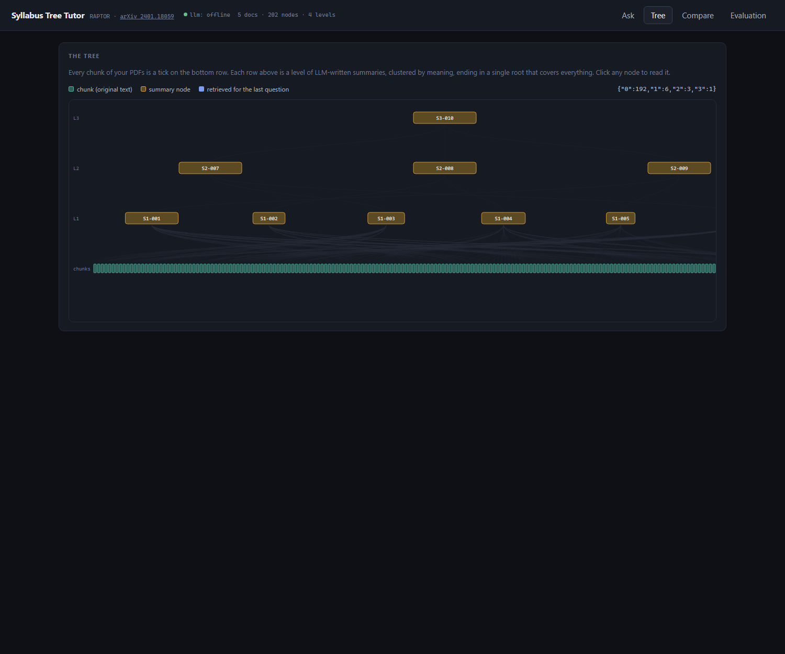
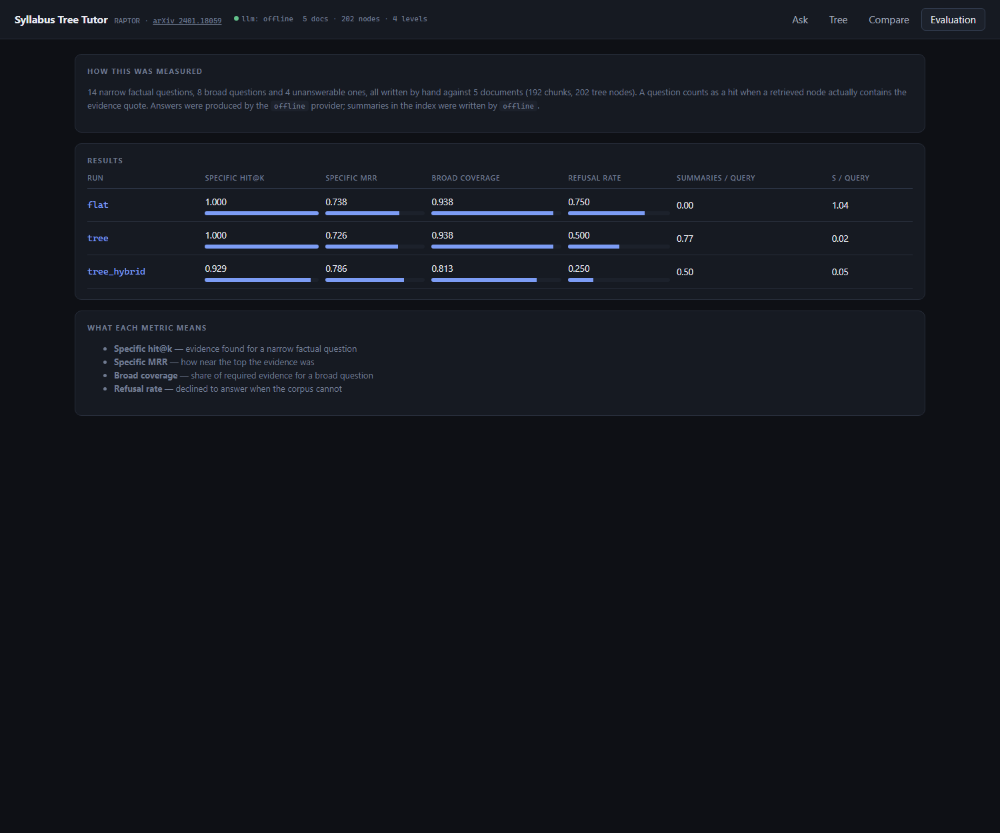

# Syllabus Tree Tutor

Question answering over your own course material, built on **RAPTOR: Recursive
Abstractive Processing for Tree-Organized Retrieval** ([arXiv 2401.18059](https://arxiv.org/abs/2401.18059)).

Ordinary RAG splits documents into chunks and searches the chunks. That works for
narrow questions ("what is the full-load slip?") and poorly for broad ones
("what does this quiz cover?"), because no single chunk contains the answer to a
broad question. RAPTOR builds **layers of summaries** on top of the chunks and
searches every layer at once, so a broad question can match a summary that
already spans thirty chunks.

This project implements that, and — more importantly — **measures whether it
actually helps**, against a flat-chunk baseline on the same index.



## What it does

- **Builds a tree** from a folder of PDFs: chunk, embed, cluster, summarise, repeat to a single root.
- **Answers questions** with inline citations back to the source file and page, streamed token by token.
- **Shows its working**: which nodes were retrieved, from which level, their cosine scores, and how many near-duplicates were skipped.
- **Compares itself to the baseline** side by side on the same question.
- **Scores itself** on a hand-written 26-question evaluation set.
- **Runs with no API key at all** (extractive fallback), or with a local model via Ollama, or with Claude/OpenAI.

## How the tree is built

```
192 leaf chunks
      ↓  embed (all-MiniLM-L6-v2, 384 dims)
      ↓  PCA to 10 dims
      ↓  Gaussian mixture, cluster count chosen by BIC, soft assignment
      ↓  summarise each cluster with an LLM
  6 level-1 summaries
      ↓  same again
  3 level-2 summaries
      ↓
  1 root
```

A chunk can belong to more than one cluster (the paper allows this: membership
probability ≥ 0.10). Answering uses the paper's **collapsed tree** approach —
every node at every level is a candidate, ranked by cosine similarity — so the
retriever chooses the level, rather than you choosing it in advance.

### Where this differs from the paper

| Paper | Here | Why |
|---|---|---|
| UMAP for dimension reduction | PCA | Ships with scikit-learn, behaves predictably on a few hundred nodes, one less dependency |
| Local + global clustering | Single-pass GMM per level | The corpus is hundreds of chunks, not thousands |
| GPT-3.5 summaries | Pluggable: Ollama / Claude / OpenAI / extractive | Runs with no key and no cost |
| QA over QuALITY, NarrativeQA | QA over your own PDFs | The point is a study tool |

## Quickstart

### 1. Backend

```bash
python -m venv .venv
.venv\Scripts\activate              # Windows;  source .venv/bin/activate elsewhere
pip install -r requirements.txt

# put your PDFs here
copy "my-notes.pdf" data\raw\

python scripts/build_index.py       # chunk, embed, cluster, summarise
cd backend
uvicorn app.api:app --reload --port 8000
```

Interactive API docs: <http://127.0.0.1:8000/docs>

### 2. Frontend

```bash
cd frontend
npm install
npm run dev                         # http://localhost:5173
```

### 3. Better summaries (optional but recommended)

The default `offline` provider writes *extractive* summaries — it picks
representative sentences rather than writing new ones. That keeps the project
runnable with zero setup, but RAPTOR's whole premise is **abstractive**
summaries, so quality improves a lot with a real model:

```bash
# install Ollama from https://ollama.com, then
ollama pull llama3.2:3b

copy .env.example .env              # set LLM_PROVIDER=ollama
python scripts/build_index.py       # rebuild so the summaries are rewritten
```

Or set `LLM_PROVIDER=anthropic` with `ANTHROPIC_API_KEY`, or
`LLM_PROVIDER=openai` with `OPENAI_API_KEY`.

## Asking from the terminal

```bash
python scripts/ask.py "what does Shift+F5 do in Aspen Plus?"
python scripts/ask.py --mode flat "what is the full-load slip?"
python scripts/ask.py --compare "what topics does the quiz cover overall?"
```

## Results



Run it yourself with `python eval/run_eval.py`; current numbers live in
[`eval/results.md`](eval/results.md) and are served to the web app from
`eval/results.json`.

The evaluation set is 26 hand-written questions over the demo corpus:
14 **specific** (one chunk holds the answer), 8 **broad** (needs several parts
of the corpus), 4 **unanswerable** (the corpus genuinely cannot answer them, so
the right response is to refuse).

| Run | Specific hit@6 | Specific MRR | Broad coverage | Refusal rate | Summary nodes / query |
|---|---|---|---|---|---|
| `flat` (baseline) | 1.000 | 0.738 | 0.938 | 0.750 | 0.00 |
| `tree` (RAPTOR) | 1.000 | 0.726 | 0.938 | 0.500 | 0.77 |
| `tree_hybrid` (+ BM25) | 0.929 | 0.786 | 0.812 | 0.250 | 0.50 |

### What didn't work, and why

**The tree has not beaten the baseline yet.** That is the honest state of this
repo, and there are three identified reasons:

1. **The summaries are extractive, not abstractive.** With `LLM_PROVIDER=offline`
   a "summary" is a handful of sentences lifted from the cluster, so a summary
   node is a worse version of its own chunks rather than a genuine overview. The
   paper's gains come from *written* summaries. Rebuilding with Ollama is the
   next experiment, and the one most likely to change the table.
2. **The broad metric saturates.** Keyword-coverage evidence is satisfied by the
   flat baseline too, so both score 0.938 and there is no room to show a
   difference. Broad questions need evidence spread across distant parts of the
   corpus that six chunks cannot cover but one summary can.
3. **The corpus is small and repetitive** — 192 chunks, and four of the five PDFs
   are variants of the same quiz. Near-duplicate filtering (cosine ≥ 0.95) was
   added because the top 6 results were otherwise four copies of one page; it
   skips 2 nodes on a typical query.

Also observed: on *specific* questions the tree sometimes ranks a broad summary
above the chunk that literally contains the number, which costs MRR
(0.726 vs 0.738). A level-aware score penalty is the obvious thing to try.

## API

| Endpoint | Purpose |
|---|---|
| `GET /api/health` | Provider readiness, index stats, embedding dimension |
| `GET /api/tree` | Every node, trimmed for drawing |
| `GET /api/node/{id}` | One node plus the nodes it was summarised from |
| `POST /api/ask` | Answer as JSON (`mode`: `tree` or `flat`) |
| `POST /api/ask/stream` | The same, streamed as server-sent events |
| `POST /api/compare` | Both retrievers on one question |
| `GET /api/eval` | Latest evaluation results |
| `POST /api/upload` | Add a PDF (rebuild the index afterwards) |

## Project structure

```
backend/app/
  config.py     every setting, all with working defaults
  ingest.py     PDF -> cleaned text -> recursive chunks (leaf nodes)
  tree.py       cluster + summarise + recurse = the RAPTOR tree
  llm.py        one interface over offline / ollama / anthropic / openai
  retrieve.py   flat vs collapsed-tree search, BM25 hybrid, RRF, dedupe
  generate.py   citation-forced prompt, citation checking, streaming
  store.py      save and load nodes.json + embeddings.npy
  api.py        FastAPI endpoints
scripts/
  build_index.py, ask.py
eval/
  golden.jsonl, run_eval.py, results.json, results.md
frontend/src/
  views/        Ask, Tree, Compare, Evaluation
  components/   TreeMap (SVG), SourceCard, TracePanel, AnswerText
```

The frontend has **no UI or charting dependencies** — the tree is hand-drawn SVG,
so the whole bundle is React plus about 700 lines of application code.

## Notes

- `data/raw/` and `data/index/` are gitignored: course material stays off GitHub.
- The URL hash selects a view and can carry a question: `#tree`, `#ask?q=what%20is%20slip`.
- Vite proxies `/api` to port 8000 in development, so there is no CORS setup.

## Next steps

- [ ] Rebuild with Ollama summaries and re-run the evaluation (expected to be the big one)
- [ ] Redesign the broad questions so the metric can discriminate
- [ ] Try a level-aware score penalty so summaries stop outranking exact chunks
- [ ] Add a cross-encoder reranker over the top 50 candidates
- [ ] Index-time deduplication, so the four quiz variants collapse into one
- [ ] Dockerfile and a deployed demo link
